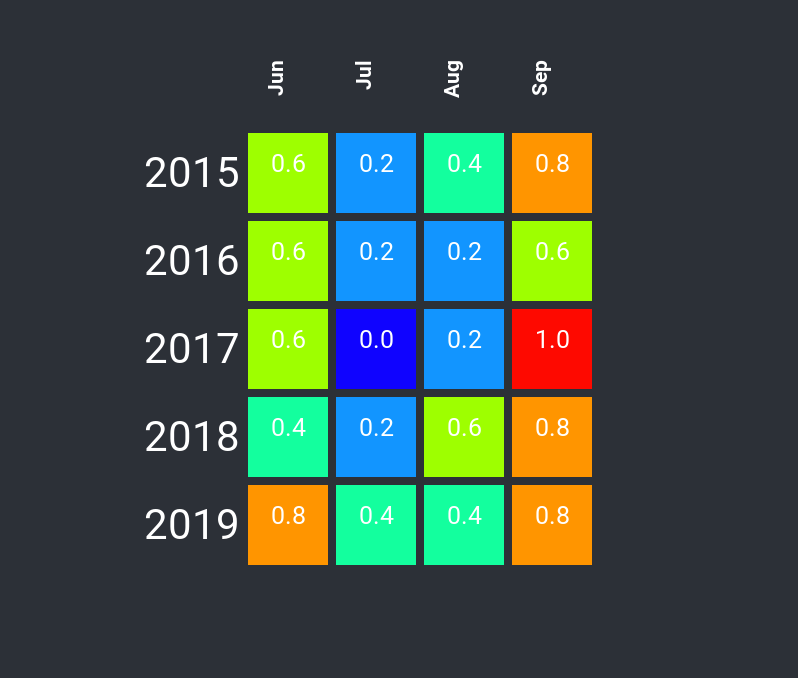

# jsheatmap
A heat map package for [Node](https://en.wikipedia.org/wiki/Node.js). You provide the column headings, row labels and row values, and it will return corresponding rgb colors that can be used to populate a table or other representation of your choosing.

## What's a heat map?
[A heat map (or heatmap) is a graphical representation of data where the individual values contained in a matrix are represented as colors.](https://en.wikipedia.org/wiki/Heat_map)

A common use of a heat map is to visualize frequency of occurrence of one variable in correlation with another. For example: the number of traffic accidents that occur along each mile of a highway, or the number of jellybeans in several sample packages.

## About the implementation
This is largely a JavaScript transliteration of Andrew Noske's C# [sample code](http://www.andrewnoske.com/wiki/Code_-_heatmaps_and_color_gradients).

# Usage
`install jsheatmap`

In your Node application, import the HeatMap class from the jsheatmap module

```js
import HeatMap from 'jsheatmap
```
Next, construct an HeatMap instance with heading and row data.

```js
// Days of rain in summer summer months, by year
const headings = ["June", "July", "August", "September"]  // the months
const rows = [
  ["2015", [9, 5, 6, 8]],   // the years and rainy days by month
  ["2016", [7, 5, 10, 7]],
  ["2017", [7, 4, 3, 9]],
  ["2018", [10, 5, 6, 8]],
  ["2019", [8, 9, 3, 1]],
]


const heatmap = new HeatMap(headings, rows)
const data = heatmap.getData();
```

The HeatMap will scale all values of the data (all rainy day values in this case), and scale those values to fit within the range 0 to 1.0.  Those scaled values are then converted to rgb colors based on a color gradient, with blue at the lowest scale and red at the highest.

Data is returned in the following format:
```json
{
  "headings": [
    "Jun",
    "Jul",
    "Aug",
    "Sep"
  ],
  "high": 9,
  "low": 4,
  "rows": [
    {
      "label": "2015",
      "cells": {
        "values": [
          7,
          5,
          6,
          8
        ],
        "colors": [
          {
            "red": 0.6249999999999998,
            "green": 1,
            "blue": 0
          },
          {
            "red": 0,
            "green": 0.588235294117647,
            "blue": 1
          },
          {
            "red": 0,
            "green": 1,
            "blue": 0.625
          },
          {
            "red": 1,
            "green": 0.588235294117647,
            "blue": 0
          }
        ],
        "scales": [
          0.6,
          0.2,
          0.4,
          0.8
        ]
      }
    },
    {
      "label": "2016",
      "cells": {
        "values": [
          7,
          5,
          5,
          7
        ],
        "colors": [
          {
            "red": 0.6249999999999998,
            "green": 1,
            "blue": 0
          },
          {
            "red": 0,
            "green": 0.588235294117647,
            "blue": 1
          },
          {
            "red": 0,
            "green": 0.588235294117647,
            "blue": 1
          },
          {
            "red": 0.6249999999999998,
            "green": 1,
            "blue": 0
          }
        ],
        "scales": [
          0.6,
          0.2,
          0.2,
          0.6
        ]
      }
    },
    {
      "label": "2017",
      "cells": {
        "values": [
          7,
          4,
          5,
          9
        ],
        "colors": [
          {
            "red": 0.6249999999999998,
            "green": 1,
            "blue": 0
          },
          {
            "red": 0,
            "green": 0,
            "blue": 1
          },
          {
            "red": 0,
            "green": 0.588235294117647,
            "blue": 1
          },
          {
            "red": 1,
            "green": 0,
            "blue": 0
          }
        ],
        "scales": [
          0.6,
          0,
          0.2,
          1
        ]
      }
    },
    {
      "label": "2018",
      "cells": {
        "values": [
          6,
          5,
          7,
          8
        ],
        "colors": [
          {
            "red": 0,
            "green": 1,
            "blue": 0.625
          },
          {
            "red": 0,
            "green": 0.588235294117647,
            "blue": 1
          },
          {
            "red": 0.6249999999999998,
            "green": 1,
            "blue": 0
          },
          {
            "red": 1,
            "green": 0.588235294117647,
            "blue": 0
          }
        ],
        "scales": [
          0.4,
          0.2,
          0.6,
          0.8
        ]
      }
    },
    {
      "label": "2019",
      "cells": {
        "values": [
          8,
          6,
          6,
          8
        ],
        "colors": [
          {
            "red": 1,
            "green": 0.588235294117647,
            "blue": 0
          },
          {
            "red": 0,
            "green": 1,
            "blue": 0.625
          },
          {
            "red": 0,
            "green": 1,
            "blue": 0.625
          },
          {
            "red": 1,
            "green": 0.588235294117647,
            "blue": 0
          }
        ],
        "scales": [
          0.8,
          0.4,
          0.4,
          0.8
        ]
      }
    }
  ]
}
```

## A visualization using React

